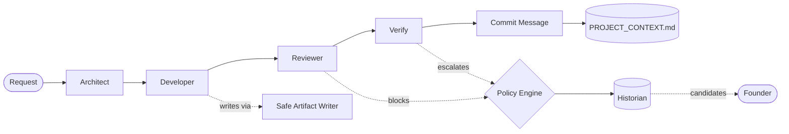
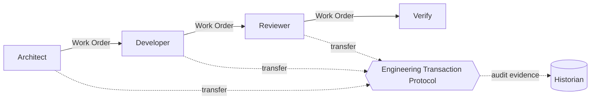

# AK Labs OS

AK Labs OS models software engineering as an organization instead of a
conversation. Rather than letting AI agents exchange unrestricted prompts,
it coordinates specialized engineering departments through governed
contracts, explicit ownership, deterministic validation, and auditable
decisions. Its goal isn't just to generate code — it's to build software
the way a disciplined engineering organization operates.

**Version:** v0.4.1-alpha · **Phase:** v0.4.2A, Architecture Reconciliation (docs only) · **Architecture:** frozen pending v0.4.2B · **Release gates:** release / regression / adversarial / dod — all passing, 100/100

> **North Star.** Build an engineering operating system where software is
> produced through explicit contracts, deterministic governance, and
> auditable decisions — so humans and AI collaborate with the discipline of
> a high-performing engineering organization, not the improvisation of a
> chat thread.

## Why this exists

Most agent frameworks optimize for one thing: get an AI to write code fast.
AK Labs OS optimizes for something else first — can the organization
reliably say what happened, what failed, what needs a human, and what
should be remembered? Code generation quality is downstream of that, not
the starting point.

Software organizations scale because of governance, not because of bigger
prompts. Many current agent systems route everything through
conversation — shared context, agent autonomy, best-effort memory. AK Labs
OS is deliberately moving departments away from that:

```text
Prompt Passing  →  Work Orders  →  Engineering Transaction Protocol
```

- **Prompt passing** (where most agent systems stop): departments hand each
  other loose natural-language context. Fast to build, impossible to audit.
- **Work Orders** (implemented, v0.4.1): departments hand off a structured
  contract instead — deterministic ID, priority, risk, acceptance criteria,
  deliverables, explicit inputs/outputs/preconditions/postconditions.
- **Engineering Transaction Protocol** (planned, v0.4.2): the act of
  transferring ownership of a Work Order between departments becomes its
  own deterministic, auditable event, instead of an informal handoff.

Work Orders describe *what the task is*. ETP will describe *who owns it
now and why*. Keeping those separate is deliberate — see
[ADR-0012](docs/DECISIONS.md#adr-0012-separate-work-order-state-from-department-transfer-behavior).

## Architecture

**Current runtime (implemented, v0.4.1):**



Departments talk through the internal brief/prompt flow today. Work Orders
exist as a domain model but aren't yet the mandatory handoff format.

**Planned department handoff (v0.4.2+):**



ETP doesn't own the Work Order schema — it only owns the act of transferring
responsibility for one. Historian still owns the audit trail; ETP just feeds it.

## Core principles

1. **One canonical owner per concern.** Every engineering concern — state,
   transfer, history, validation, policy, artifacts — has exactly one
   subsystem that owns it. Others may reference it, none may compete with it.
2. **Explicit over implicit.** Policies, capabilities, contracts, and
   escalation levels are all named, not inferred.
3. **Deterministic over conversational.** Sequential Work Order IDs, syntax
   checks, duplicate-artifact rejection — reproducible behavior wins over
   flexible behavior wherever it matters.
4. **Architecture before implementation.** Architecture is approved via ADR
   before code follows it, not the other way around.
5. **Historian suggests, humans decide.** Organizational memory surfaces
   patterns; it never edits policy itself.
6. **Evidence before confidence.** No subsystem accepts an LLM's
   self-reported confidence as a release gate — only retries, pass/fail
   checks, and logged outcomes count as evidence.
7. **Unsafe is rejected, not repaired.** Invalid paths, traversal attempts,
   and protected-file writes are blocked outright, never silently normalized.

## Canonical ownership

| Concern | Canonical owner | Status |
|---|---|---|
| Engineering state | Work Orders | Implemented |
| Ownership transfer | Engineering Transaction Protocol | Planned (v0.4.2) |
| Historical record | Historian | Implemented |
| Validation results | Validation Harness | Implemented |
| Policy enforcement | Policy Engine | Implemented |
| Artifact persistence | Safe Artifact Writer | Implemented |
| Repository knowledge | Repository Intelligence | Planned |
| Context construction | Context Builder | Planned |

## Compared to typical agent frameworks

*(e.g. Cursor, AutoGen, CrewAI — patterns, not a claim about any specific product's internals)*

| Typical agent framework | AK Labs OS |
|---|---|
| Prompt passing | Work Orders |
| Conversations | Engineering contracts |
| Shared context | Explicit ownership |
| Agent autonomy | Policy-governed departments |
| Best-effort memory | Historian with an audit trail |
| Flexible behavior | Deterministic validation |

## Current state: v0.4.1-alpha

**Implemented:**

- Policy Engine — every policy carries `none | review | approval |
  emergency`, decisions logged to SQLite (`policies.yaml`, `policy_engine.py`)
- Capability routing — policies name a capability (`reasoning_high`), never
  a model; `capabilities.yaml` is the only file that names real models
- Reviewer gate — blocks insecure code (SQL injection, command execution,
  destructive filesystem ops, protected-file mutation) before Verify runs
- Verify gate — checks output exists, is non-empty, and parses
- Historian — computes real evidence from the policy log, detects repeated
  escalations, surfaces them as candidates; never edits policy itself
- Safe Artifact Writer — rejects unsafe paths (traversal, absolute paths,
  workspace escapes, protected-file writes, duplicate collisions) instead
  of silently normalizing them
- Work Order domain model — schema, deterministic `WO-000001`-style IDs,
  lifecycle transitions, structured contracts, JSON serialization
- Release Validation Harness — deterministic release/regression/adversarial/
  DoD gates with JSON + Markdown reports

**Deliberately not yet implemented:**

- Work Orders are not yet mandatory at runtime — departments can still pass
  natural-language briefs until an integration milestone requires the
  structured handoff
- Engineering Transaction Protocol — architecture only, no code yet
- Confidence scores — an LLM self-reporting "96% confident" is the same
  fabrication risk this system exists to catch; this waits until Historian
  has enough real outcome data to compute confidence from evidence
- Policy inheritance (staging → production) — at this policy count,
  explicit beats resolved
- Repository intelligence, context builder, real test execution, Git/
  release automation, durable approval queue

## Where it's heading: v0.4.2

1. **v0.4.2A — Architecture Reconciliation** (documentation only, no
   runtime or validation code changes) — current phase
2. **v0.4.2B — Protocol Specification** (transaction envelope, transfer
   semantics, validation cases)
3. **v0.4.2C — Runtime Implementation**
4. **v0.4.2D — Integration**

Only phase A is documentation-only — the milestone as a whole is not.

## Quickstart (free, no API key needed)

```bash
pip install -r requirements.txt
python orchestrator.py "Build a function that validates an email address" --mock
```

Runs Architect → Developer → Reviewer → Verify → Commit message entirely
offline, using canned responses. This is how you test pipeline changes
without spending a token.

## Quickstart (real, calls Groq)

```bash
cp .env.example .env
# paste your GROQ_API_KEY into .env
python orchestrator.py "Build a function that reverses a string"
```

Same pipeline, but Architect and Developer calls hit Groq for real, using
whatever models are set under `route_model_by_task` in `policies.yaml`.

## What each file does

| File | Role |
|---|---|
| `ARCHITECTURE.md` | The project's constitution — vision, architectural principles, current status against them |
| `culture.yaml` | Organization-wide engineering standards — what "good" looks like here, not procedure |
| `policies.yaml` | Every policy: trigger, action, capability needed, `interrupt_level`, and what counts as "this needs AK" |
| `capabilities.yaml` | The ONLY file that names actual models. Maps `reasoning_high` → `claude-sonnet-5`, etc. |
| `capability_router.py` | Resolves a capability name to a live provider + model |
| `policy_engine.py` | Loads policies, evaluates escalation, logs every decision to SQLite |
| `historian.py` | Reads that log, computes real evidence per policy, surfaces repeated escalations as candidates for AK to decide — never edits policy itself |
| `llm_router.py` | Calls whatever model `capability_router` resolved (Groq or Claude) |
| `orchestrator.py` | The actual pipeline: scope → code → review → verify → commit → log |
| `safe_artifact_writer.py` | Centralized filesystem safety layer for runtime project artifacts |
| `work_orders/` | Canonical Work Order schema, lifecycle, validation, and serialization |
| `validation/` | Release Validation Harness — deterministic release gates |
| `dev_tools.py` | Verification helpers (`check-log`, `break-output`, `simulate-escalations`) — proves each guarantee with one plain command, no inline scripting needed |
| `PROJECT_CONTEXT.md` | Auto-created/appended after every run — your durable run history |
| `ak_labs_os.db` | Auto-created SQLite (WAL) — `policy_log` (audit trail), `policy_candidates` (Historian's output), `engineering_reviews`, `filesystem_events` |

For architecture detail, decisions, contribution workflow, and roadmap, see
[START_HERE.md](START_HERE.md) and the [docs/](docs/) directory.

## Using Historian

```bash
python historian.py stats verify_output   # real evidence: run count, escalation rate, top reasons
python historian.py scan                  # scan policy_log, surface new repeated-escalation candidates
python historian.py review                # list candidates awaiting your decision
python historian.py decide 1 approve      # record your decision — does NOT touch policies.yaml
```

Approving a candidate never edits `policies.yaml` for you. It closes the
loop in organizational memory so the same pattern doesn't get re-surfaced —
but if a policy should actually change, that edit stays explicit and
human-made. That split is deliberate (see
[ADR-0003](docs/DECISIONS.md#adr-0003-historian-suggests-humans-decide)).

## interrupt_level

Every policy carries `none | review | approval | emergency` instead of a
flat escalate/proceed flag:

- `none` — never escalates (e.g. creating a feature branch)
- `review` — proceeds with a fallback, flagged for you to glance at later (e.g. a capability resolution hiccup)
- `approval` — stops and blocks until you look (e.g. verify_output failing, a staging deploy)
- `emergency` — stops, blocks, highest consequence (schema migrations)

## Try breaking it on purpose

Prove the anti-fabrication gate is real, not decorative:

```bash
python3 -c "
from pathlib import Path
from policy_engine import load_policies
from orchestrator import verify_output
Path('output').mkdir(exist_ok=True)
bad = Path('output/broken.py')
bad.write_text('def broken(:')          # invalid syntax on purpose
print(verify_output(bad, load_policies()))
"
```

You should see `passed: False` and an escalation reason. If this pipeline
ever claims success on broken or missing output, that's a bug in
`verify_output()`, not a policy problem — file it as priority one.

## Contributing

Read [START_HERE.md](START_HERE.md) before changing anything — it covers
branch model, validation workflow, and the architecture freeze policy.
Architectural changes require an ADR in [docs/DECISIONS.md](docs/DECISIONS.md).
